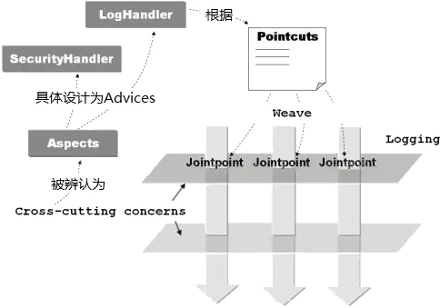

#2021.1.1
1. IOC控制反转，即 对象由Spring来进行创建，管理和装配
控制：谁来控制对象的创建，传统应用是由程序本身控制创建的，Spring是由Spring来控制创建的。
反转：程序本身不创建对象，将对象的创建托管给Spring
依赖注入DI：利用Set方法进行注入
2. ApplicationContext为Spring容器，对象bean可以从该容器中直接获取。ApplicationContext有很多子类，其中ClassPathXmlApplicationContext是根据XML配置文件创建对象；AnnotationConfigApplicationContext是根据注解来创建对象。

#2021.1.2
1. IOC创建对象的方式，默认使用无参构造方法。
2. 使用constructor-arg配置，使用有参构造方法构造。
3. 所有在beans中配置的对象，在配置加载的时候，就会进行对象初始化了。
4. 每份对象在spring容器中只有一份实例。

#2021.1.3
1. 依赖注入DI三种方式：构造器注入，setter注入，拓展方式注入
2. 构造器注入，使用constructor-arg配置, C命名空间
3. setter注入，例如数组，String，properties或者对象怎么赋值,即属性注入,P命名空间
4. 拓展方式注入: C命名空间和P命名空间
5. bean scopes bea作用域, singleton单例模式. Prototype原型模式

#2021.1.6
1. bean的自动装配，Spring会再上下文中自动寻找，并自动给bean装配属性。
a. 在xml进行显式配置
b. 在java中显式配置
c. 隐式自动装配bean
AntoWird byName byType
2. 使用注解实现

#2021.1.7
1. 使用注解实现beans自动装配

#2021.1.10
1, 注解类型。
@Autowired 直接在属性上使用即可，可以在set上使用，前提是在IOC容器以及配置了beans。在IOC中查找的容器顺序为 byType-ByName-Qualified 
@Nullable 标记属性值可以为null
@Qualified
@Resource java本身的注解，byName-byType
2. 可以使用java的配置，完全替代XML的配置，spring4之后，成为核心功能
```java
@Configuration
public class AppConfig {

    @Bean
    public MyService myService() {
        return new MyServiceImpl();
    }
}
```
等价于
```xml
<beans>
    <bean id="myService" class="com.acme.services.MyServiceImpl"/>
</beans>
```
3. 初看spring boot项目

# AOP
## 代理模式 
代理模式就是Spring AOP的底层实现模式
中介
### 静态代理
####角色分析
* 抽象角色，一般会使用接口或者抽象类来解决
* 真实角色，被代理的角色
* 代理角色，代理真实角色后，一般会做一些附属操作
* 客户，访问代理对象的人

####优点
* 可以使真是角色的操作更加纯粹，不需要关注其他公共业务
* 公共业务可以交给代理实现，业务的分工明确
* 公共业务方便拓展，方便集中管理

####缺点
* 一个真实角色就会产生一个代理角色，代码量翻倍，开发效率变低

####静态代理的代码实现过程
1. 实现接口
2. 实现真实角色
3. 实现代理
4. 客户端访问代理

###动态代理

####角色分析
* 动态代理和静态代理角色相同
* 动态代理的 **代理类** 是动态生成的，不是直接写好的

####动态代理的分类
分成两大类：基于接口和基于类的动态代理
* 基于接口的动态代理，例如JDK动态代理
* 基于类的动态代理，例如cglib
* java字节码实现，例如javasist

1.InvocationHandler， JDK调用处理接口
2. Proxy， JDK代理接口

####优点
1. 同静态代理
2. 一个动态代理类可以代理一类真实角色，代码里大大减少

#AOP
面向切面编程，动态代理

1. 横切关注点，对哪些方法进行拦截，拦截后怎样处理。

2. 切面(ASPECT)，散落在系统各处通用的业务逻辑代码，如日志模块、权限模块、事务模块等。
   * 切面用来装载切入点PointCut和通知Advice
   * 切面通常是一个类，可以定义切入点和通知。类是对物体特征的抽象，切面是**对横切关注点的抽象**。
   * 切面是业务流程运行的某个特定步骤，是应用运行过程中的关注点，关注点通常会横切多个对象，因此也被称为横切关注点。

3. 连接点(JointPoint)
   * 连接点是程序执行过程中明确的点，一般是类中方法的调用。
   * 连接点是程序在运行过程中能够插入切面的地点，比如方法调用、异常抛出、字段修改等。

4. 通知(Advice)
   * 通知是AOP在特定切入点上执行的增强处理，是拦截到连接点之后要执行的代码
   * 通知可以分为前置通知Before、后置通知AfterReturning、异常通知AfterThrowing、最终通知After、环绕通知Around五类。

5. 切入点(PointCut)
   * 切入点是**带有通知的连接点**，在程序中主要体现为编写切入点表达式。
   * 切入点是对连接点进行拦截的定义
   * 切入点用于**定义通知应该切入到哪些连接点上，不同的通知需要切入到不同的连接点上，这种精准的匹配是由切入点的正则表达式来定义的**。
   * 切入点是可以插入增强处理的连接点，当某个连接点满足执行要求时，该连接点将被连接增强处理，该连接点也就变成了切入点。
   * 切入点是拦截的方法，连接点JointPoint拦截后将变成切入点。
   
   **execution语法**
   基本语法格式为：execution(<修饰符模式>?<返回类型模式><方法名模式>(<参数模式>)<异常模式>?)
   除了返回类型模式、方法名模式和参数模式外，其它项都是可选的，例如：
   通过方法签名定义切点 execution(public * *(..))
   匹配所有目标类的public方法，但不匹配SmartSeller和protected voidshowGoods()方法。
   第一个*代表返回类型，第二个*代表方法名，而..代表任意入参的方法；
   
   execution(* com.sample.service.impl..*.*(..))
   |符号  |含义   |
   |------|------|
   |execution()|表达式的主体|
   |第一个*符号|表示返回值的类型任意|
   |com.sample.service.impl|AOP所切的服务的包名|
   |包名后面的'..'|表示当前包及子包|
   |第二个*|表示类名，*即所有类|
   |.*(..)|表示任何方法名，括号表示参数，两个点表示任何参数类型|
   
6. Proxy 代理对象
   * 代理对象是AOP创建的对象，包含通知，代理是目标对象的加强。 
   * 代理是将通知应用到目标对象之后被动态创建的对象，可以简单理解代理对象的功能等同于目标对象的核心业务逻辑功能加上共有功能。
   * 代理对象对于使用者而言是透明的，是程序运行过程中的产物。
   
7. Weaving 织入
   * 通过切入点切入，将切面应用到目标对象并导致代理对象创建的过程。
   * 将切面应用到目标对象从而创建一个新的代理对象的过程，这个过程可以发生在编译器、类转载期、运行期，不同的发生点有着不同的前提条件。
   * 如果发生在编译器就需要有一个支持这种AOP实现的特殊编译器，发生在类转载期就需要有一个支持AOP实现的特殊类转载其，发生在运行期则可以直接通过反射机制与动态代理机制来动态实现。
   
8. Target 目标对象
   * 目标对象是指代理的目标对象，是指要织入的对象模块。
   * 目标对象是那些即将切入切面的对象，也就是被通知的对象。
   * 这些对象中已经只剩下干干净净的核心业务逻辑代码，所有的共有功能等待AOP容器的切入。
   * 目标对象是AOP进行增强处理的对象，也被称为增强的对象。如果AOP是通过运行时代理来实现的，那么这个对象将是一个被代理的对象。



## AOP实现
1. 使用Spring API， 例如MethodBeforeAdvice，AfterReturningAdvice
2. 使用自定义类，配置**切面**实现，特别关注通知的传参！！
3. 注解实现，关注环绕通知的连接点概念

# 整合Mybatis